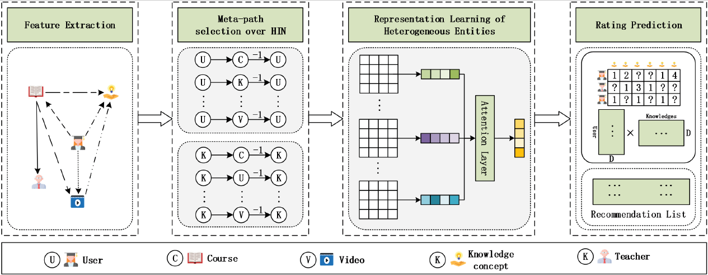

# Attentional Graph Convolutional Networks for Knowledge Concept Recommendation in MOOCs in a Heterogeneous View

Original implementation for paper [Attentional Graph Convolutional Networks for Knowledge Concept Recommendation in MOOCs in a Heterogeneous View](https://arxiv.org/abs/2006.13257)

## Abstract



  Massive open online courses are becoming a modish way for education, which provides a large-scale and open-access learning opportunity for students to grasp the knowledge. To attract students' interest, the recommendation system is applied by MOOCs providers to recommend courses to students. However, as a course usually consists of a number of video lectures, with each one covering some specific knowledge concepts, directly recommending courses overlook students' interest to some specific knowledge concepts. To fill this gap, in this paper, we study the problem of knowledge concept recommendation. We propose an end-to-end graph neural network-based approach called **A**ttentional Heterogeneous Graph **C**onvolutional Deep **K**nowledge **Rec**ommender(**ACKRec**) for knowledge concept recommendation in MOOCs. Like other recommendation problems, it suffers from sparsity issues. To address this issue, we leverage both content information and context information to learn the representation of entities via graph convolution network. In addition to students and knowledge concepts, we consider other types of entities ( e.g., courses, videos, teachers) and construct a heterogeneous information network to capture the corresponding fruitful semantic relationships among different types of entities and incorporate them into the representation learning process. Specifically, we use meta-path on the HIN to guide the propagation of students' preferences. With the help of these meta-paths, the students' preference distribution with respect to a candidate knowledge concept can be captured. Furthermore, we propose an attention mechanism to adaptively fuse the context information from different meta-paths, in order to capture the different interests of different students. The promising experiment results show that the proposed ACKRecis able to effectively recommend knowledge concepts to students pursuing online learning in MOOCs.

## Citing ACKRec

If you use ACKRec in your research or wish to refer to the baseline results, please use the following BibTeX.

```
@article{wang2020attentional,
  title={Attentional Graph Convolutional Networks for Knowledge Concept Recommendation in MOOCs in a Heterogeneous View},
  author={Wang, Shen and Gong, Jibing and Wang, Jinlong and Feng, Wenzheng and Peng, Hao and Tang, Jie and Yu, Philip S},
  journal={arXiv preprint arXiv:2006.13257},
  year={2020}
}
```

